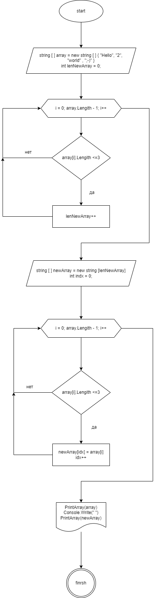

# Что такое Markdown
Markdown - язык текстовой разметки созданный писателем и блогером Джоном Грубером. Он преднозначен для создания кросиво оформленных текстов в обчном файлах формата ТХТ. Вам не нужны громоздкие процесоры вроде Word или Pages, что бы создавать документы с жирным или курсивным начертанием, цитатами, сылками и даже таблицами. Достаточно запомнить простыми провила Markdown и можно писать в <<Блокноте>>. Хотя специалезированные Markdown - редакторы, конечно, на много удобнее.

## Гдеможно использовать Markdown
### Заметки
Редактор Markdown с файловой панелю (напрмер, Atom или iAWrite) - это вполне достойная алтернатива Evernote и OneNote. Мы писали, почему Markdown хорош для организации вашей базы заметок.

Markdown - это легкий язык разметки, который позволяет быстро и просто форматировать текст для веба. Вот основные элементы:

1. Заголовки: Используйте символ "#" перед текстом для создания заголовков разного уровня (# для заголовка 1-го уровня, ## для заголовка 2-го уровня и так далее).

2. Текстовое форматирование: 
   - *Курсив* - обрамите текст звездочками или подчеркиваниями (\*Курсив\* или \_Курсив\_).
   - Жирный - обрамите текст двумя звездочками или подчеркиваниями (\*\*Жирный\*\* или \_\_Жирный\_\_).

3. Списки:
   - Неупорядоченный список: начните каждую строку с "-", "*", или "+", чтобы создать список.
   - Упорядоченный список: начните каждую строку с номера и точки.

4. Ссылки: Используйте [текст](URL) для создания гиперссылок.

5. Изображения: Формат такой же, как у ссылок, но с восклицательным знаком перед квадратными скобками: .

6. Цитаты: Используйте символ ">" перед текстом цитаты.

7. Код: Встроенный код обрамляется обратными апострофами (\код\), блочный код - тремя обратными апострофами (`код```).

8. Горизонтальная черта: Используйте "---" или "***" для создания горизонтальной черты.

Это основы Markdown. Он поддерживается многими платформами, такими как GitHub, Reddit, и многими другими.

## Что такое C#
C# (произносится как "си-шарп") - это мощный и элегантный объектно-ориентированный язык программирования, разработанный компанией Microsoft. Он был выпущен в 2000 году и стал широко используемым для создания различных типов приложений, включая приложения для Windows, веб-приложения, игры, мобильные приложения и многое другое.

Некоторые ключевые особенности C#:

1. Синтаксис, подобный C++ и Java: C# унаследовал многие синтаксические черты от языков C++ и Java, что делает его знакомым для разработчиков, знакомых с этими языками.

2. Сильная типизация: C# - это язык со строгой типизацией, что помогает выявлять ошибки на этапе компиляции.

3. Поддержка платформы .NET: C# интегрирован с платформой .NET, что обеспечивает доступ к большому количеству библиотек и инструментов для разработки.

4. Управляемый код: Все программы на C# компилируются в промежуточный язык (IL), который исполняется виртуальной машиной Common Language Runtime (CLR).

5. Мощные средства разработки: Среди них Visual Studio - интегрированная среда разработки от Microsoft, которая предоставляет широкие возможности для создания, отладки и поддержки приложений на C#.

C# стал одним из основных языков программирования для разработки приложений в экосистеме Microsoft, и его популярность продолжает расти в различных областях разработки программного обеспечения.


## Код для выведение масива
Commands();
string[] array = new string[] {};

string fromUser = ReadInput("Введите команду: ");
switch (fromUser)
{
    case "1":
        array = new string[] { "Hello", "2", "world", ":-)" };
        break;
    case "2":
        array = new string[] { "1234", "1567", "-2", "computer science" };
        break;
    case "3":
        array = new string[] { "Russia", "Denmark", "Kazan" };
        break;
    default:
        Console.WriteLine($"{fromUser} - Такой команды нет");
        break;
}


int lenNewArray = 0;
for (int i = 0; i <= array.Length - 1; i++)
{
    if (array[i].Length <= 3) lenNewArray++;
}

string[] newArray = new string[lenNewArray];
int idx = 0;

for (int i = 0; i <= array.Length - 1; i++)
{
    if (array[i].Length <= 3)
    {
        newArray[idx] = array[i];
        idx++;
    }
}

PrintArray(array);
Console.Write("→ ");
PrintArray(newArray);

// Функция: Вывод команд для работы с программой
void Commands()
{
    Console.WriteLine();
    Console.WriteLine("СПИСОК КОМАНД:");
    Console.WriteLine("1 – использовать массив: [“Hello”, “2”, “world”, “:-)”]");
    Console.WriteLine("2 – использовать массив: [“1234”, “1567”, “-2”, “computer science”]");
    Console.WriteLine("3 – использовать массив: [“Russia”, “Denmark”, “Kazan”]");
    Console.WriteLine();
}

// Функция ввода
string ReadInput(string msg)
{
    Console.Write(msg);
    return Console.ReadLine();
}

//  Функция вывода массива в терминал
void PrintArray(string[] array)
{
    Console.Write("[ ");
    for (int i = 0; i < array.Length; i++)
    {
        Console.Write($"“{array[i]}”, ");
    }
    Console.Write("] ");
}


### Блок схемы 
